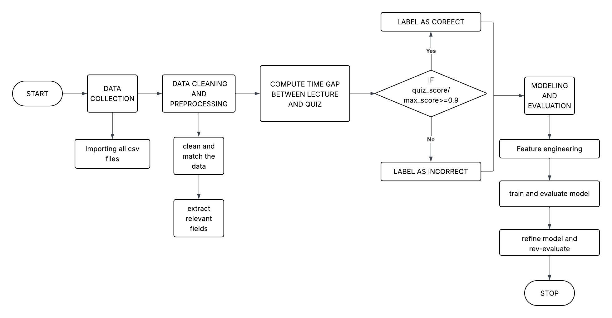
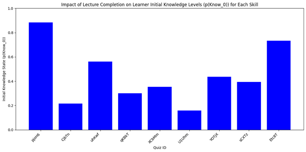
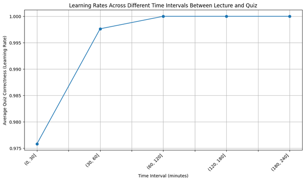
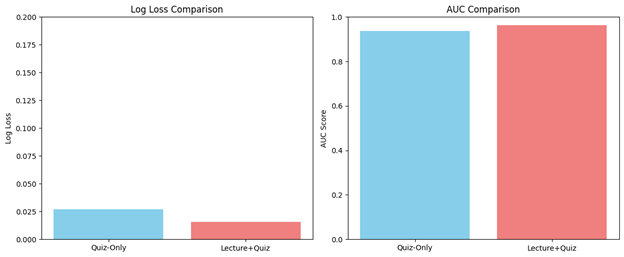

# Bayesian-Knowledge-Tracing-for-Lecture-Quiz-Sequences
Modeling Knowledge Progression in MOOCs

  
  
  
  
  

<i>An extended BKT model that integrates lecture engagement and time-gap data to improve knowledge state estimation in online learning environments.</i>

<!-- REPLACE with your banner or demo image -->
<!--  -->

# Project Overview
Massive Open Online Courses (MOOCs) have transformed scalable education, yet accurately tracking student knowledge remains a challenge. Traditional Bayesian Knowledge Tracing (BKT) models rely solely on quiz results — ignoring whether students engaged with lecture content at all.
This project addresses that gap by building a Lecture-Quiz BKT model that incorporates:

✅ Whether a student completed the lecture before attempting the quiz 

✅ The time gap (in minutes) between lecture completion and quiz submission

We compare this against a baseline Quiz-Only BKT model using a dataset of 6,000+ lecture–quiz records from a Coursera MOOC.

> Key Finding: The Lecture-Quiz model achieved an AUC of 0.9640 and Log-Loss of 0.0156, outperforming the Quiz-Only model (AUC: 0.9370 | Log-Loss: 0.0272).

# Research Questions
📌RQ1 What is the effect of lecture completion on initial knowledge states p(Know₀) across different learner profiles? 

📌RQ2 How do different time intervals between lecture completion and quiz attempts impact the learning rate p(Learn)? 

📌RQ3 Can lecture-quiz sequences improve the predictive accuracy of BKT models compared to quiz-only models? 

#  Workflow

  <em>Figure 1 — End-to-end pipeline: from raw Coursera data to BKT knowledge state predictions</em>

**The pipeline follows five stages:**
* Data Input: Raw Coursera logs: student IDs, lecture metadata, timestamps, quiz grades
* Feature Engineering: Derives lecture completion status, time gap, and binary quiz outcome
* Dataset Creation: Reshapes data into pyBKT-compatible format (student_id, skill_name, correct, time_gap)
* BKT Model Layer: Fits p(Know₀), p(Learn), p(Guess), p(Slip) using pyBKT
* Output: Predicted knowledge states across quiz attempts

## Dataset
The dataset `final_dataset.csv` is derived from Coursera activity logs and contains **6,000+ lecture–quiz interaction records**.

| Column | Type | Description |
|--------|------|-------------|
| `Student ID` | String | Anonymized unique student identifier |
| `Lecture ID` | String | Unique identifier for each lecture |
| `Lecture Completed` | Yes / No | Whether the lecture was completed before the quiz |
| `Lecture Time` | Timestamp | Date and time of lecture completion |
| `Quiz ID` | String | Unique identifier for each quiz (used as skill name) |
| `Quiz Correct (1)/Incorrect (0)` | Binary | Quiz outcome: 1 = correct, 0 = incorrect |
| `Quiz Time` | Timestamp | Date and time of quiz attempt |
| `Time Gap (mins)` | Integer | Minutes elapsed between lecture and quiz |

**Preprocessing rules applied:**

| Rule | Detail |
|------|--------|
| Quiz correctness | score ≥ 90% of max → `1` (Correct), otherwise → `0` (Incorrect) |
| Negative time gaps | Treated as lecture not completed |
| Large time gaps | Gaps > 90 days removed as noise |
| Time gap bins | `(0–30]` `(30–60]` `(60–120]` `(120–180]` `(180–240]` minutes |

---

## Methodology

### BKT Parameters Estimated

| Parameter | Description |
|-----------|-------------|
| `p(Know₀)` | Initial probability that a student already knows the skill |
| `p(Learn)` | Probability of transitioning from unknown → known after practice |
| `p(Slip)` | Probability of answering incorrectly despite knowing |
| `p(Guess)` | Probability of answering correctly without knowing |

### Models Compared

| Model | Input Features |
|-------|----------------|
| **Lecture-Quiz Model** | Quiz outcome + lecture completion status + time gap |
| **Quiz-Only Model** | Quiz outcome only (baseline) |

> Both models were implemented using the **pyBKT** library with `seed=42` and `num_fits=1`.

# Results & Findings
**RQ1 — Lecture Completion vs. Initial Knowledge p(Know₀)**

  
   
  <em>Figure 2 — Initial Knowledge States p(Know₀) by Lecture Completion across Quiz Topics</em>

Students who completed lectures had significantly higher initial knowledge states
pjoH6 (Key Concept Quiz) — highest p(Know₀) > 0.9
U1Uhm (Aging Onto The Street) — lowest p(Know₀) < 0.2
Confirms that lecture engagement builds a stronger knowledge foundation

**RQ2 — Time Gap vs. Learning Rate p(Learn)**

  
   
  <em>Figure 3 — Learning Rate p(Learn) across Time Intervals Between Lecture and Quiz</em>

Students who waited > 60 minutes after a lecture before taking the quiz showed higher learning rates
p(Learn) peaked at 1.0 in the 60–120 minute interval
Students who rushed the quiz (< 60 mins) showed noticeably lower retention

**RQ3 — Predictive Accuracy: Lecture-Quiz vs. Quiz-Only**

  
   
  <em>Figure 4 — AUC and Log-Loss Comparison: Lecture-Quiz Model vs. Quiz-Only Model</em>

MetricQuiz-Only ModelLecture-Quiz ModelImprovementAUC ↑0.93700.9640+2.7%Log-Loss ↓0.02720.0156−42.6%
The Lecture-Quiz model outperformed the baseline on both metrics — better classification accuracy and more confident predictions.

  Built with ❤️ using pyBKT and Python | INFO 5731: Computational Methods for Information Systems| University of North Texas

 

